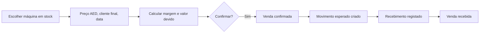

# Contas Correntes — Especificação para Claude Code

Data: 2026-09-22 · Autora: Andreia Fernandes

## Contexto e objetivo

O módulo Contas Correntes devolve à All4laser o controlo financeiro da parceria com a Laserix (Dubai) e dá visibilidade mensal de cashflow sobre todos os clientes com pagamentos diferidos. Hoje a reconciliação depende do Excel enviado pela Laserix; passa a depender de registos nossos, com o ficheiro deles reduzido a input de reconciliação.

Dois tipos de relação a cobrir com o mesmo modelo:

- Consignação (Laserix): equipamentos enviados a custo declarado, vendidos por eles no UAE; a All4laser recebe custo + 50% da margem, em AED.
- Prestações (outros clientes): venda ou aluguer com plano de pagamento faseado, em EUR ou outra moeda.

Resultados esperados:

1. Saldo por cliente sempre atualizado do nosso lado, sem depender de ficheiros externos.
2. Relatório de divergências entre o Excel da Laserix e os nossos registos, por número de série.
3. Portal onde cada cliente vê a sua conta (equipamentos, vendas, prestações, saldo) e deixa de haver dúvidas.
4. Previsão de recebimentos por mês e por moeda para a tesouraria.

## Decisões de arquitetura

O módulo vive dentro do app.all4laser.com (Next.js/Supabase/Vercel) e reutiliza a tabela `equipamentos` e as contas de cliente do módulo financeiro; não se cria uma app nem uma base de dados nova.

| Decisão | Escolha | Porquê |
| --- | --- | --- |
| Onde vive | Módulo `contas-correntes` no back-office existente | Equipamentos, clientes e faturação já estão no Supabase; evita duas verdades |
| Portal do cliente | Route group `(portal)` no mesmo projeto Next.js, servido em `portal.all4laser.com` | Um deploy, mesma base de dados, código de cálculo partilhado |
| Isolamento de dados | Row Level Security por `conta_id`, com `portal_users` a ligar utilizador Supabase Auth a uma conta | O cliente só lê a sua conta; a regra fica na base de dados, não no código |
| Autenticação portal | Supabase Auth com magic link (sem password) | Menos suporte, menos risco |
| Papel do portal | Só leitura na fase 2; registo de vendas pela Laserix (com validação nossa) só na fase 3 | Primeiro consolidar os dados |
| Moedas | Todos os montantes guardados na moeda de origem + taxa + contravalor EUR por movimento | A conversão é feita em Portugal; a taxa muda por movimento |
| Custo | `custo_declarado` na conta é distinto de `equipamentos.valor_compra` | Nas contas com a Laserix vale o custo acordado; o nosso custo é referência interna |
| Fonte de verdade | Registos da app; o Excel da Laserix é importado só para reconciliação | Inverte a dependência atual |
| Cálculos | Funções SQL/views no Supabase, não no frontend | O back-office e o portal mostram sempre o mesmo número |

## Modelo de dados

Sete tabelas novas no projeto Supabase "Produtividade", todas com `created_at`, `updated_at` e `created_by`. Referências a equipamentos e clientes apontam para as tabelas existentes.

| Tabela | Campos principais | Notas |
| --- | --- | --- |
| `cc_contas` | `id`, `cliente_id` (FK clientes existentes), `nome`, `tipo` (consignacao / prestacoes / mista), `moeda` (EUR / AED / GBP…), `taxa_contratual` (nullable), `partilha_margem_pct` (default 50), `ativa` | Uma conta por parceiro/cliente; a Laserix é uma conta tipo consignação em AED |
| `cc_consignacoes` | `id`, `conta_id`, `equipamento_id` (FK equipamentos), `numero_serie`, `custo_declarado`, `moeda_custo` (EUR), `origem` (envio\_direto / medika\_bazaar / outro), `data_envio`, `estado` (em\_stock / vendido / devolvido / cancelado), `entidade_faturada` (laserix / dermamed), `notas` | Uma linha por máquina enviada; conjuntos Cynosure + Zimmer podem ser uma linha com `equipamento_id` do laser e `acessorios` em jsonb |
| `cc_vendas` | `id`, `consignacao_id`, `data_venda`, `preco_venda`, `moeda_venda` (AED), `cliente_final`, `taxa_cambio_custo` (EUR→AED usada no custo), `custo_convertido`, `margem`, `valor_devido`, `estado` (registada / confirmada / recebida) | Campos calculados preenchidos por trigger a partir da secção Lógica de cálculo |
| `cc_planos_pagamento` | `id`, `conta_id`, `descricao`, `equipamento_id` (nullable), `valor_total`, `moeda`, `n_prestacoes`, `periodicidade` (mensal / trimestral / custom), `data_inicio`, `entrada` (nullable), `estado` | Gera as prestações; um plano pode cobrir uma venda ou um aluguer |
| `cc_prestacoes` | `id`, `plano_id`, `numero`, `data_vencimento`, `valor`, `moeda`, `estado` (pendente / paga / parcial / atrasada), `movimento_id` (nullable) | Linhas geradas na criação do plano; editáveis à mão |
| `cc_movimentos` | `id`, `conta_id`, `tipo` (esperado / recebido / nota\_credito / ajuste), `data`, `valor`, `moeda`, `taxa_cambio_eur`, `valor_eur`, `origem_tipo` (venda / prestacao / manual), `origem_id`, `referencia_bancaria`, `fatura_keyinvoice_id` (nullable), `notas` | O ledger; o saldo é a soma de esperados menos recebidos |
| `cc_reconciliacoes` | `id`, `conta_id`, `data_import`, `ficheiro_nome`, `linhas_total`, `divergencias` (jsonb), `estado` (aberta / resolvida) | Uma linha por importação do Excel da Laserix |
| `portal_users` | `user_id` (FK auth.users), `conta_id`, `email`, `nome`, `ativo` | Liga o login do portal a uma conta |

Views de leitura (usadas pelo back-office e pelo portal):

- `v_cc_saldo_conta`: por conta, total esperado, total recebido, saldo, na moeda da conta e em EUR.
- `v_cc_extrato`: movimentos ordenados por data com saldo acumulado.
- `v_cc_cashflow_mensal`: valores esperados por mês e moeda, separando prestações agendadas de vendas por receber.
- `v_cc_consignacao_stock`: máquinas em stock no parceiro, com custo declarado e dias desde o envio.

## Lógica de cálculo

Todos os cálculos correm em funções SQL no Supabase; o frontend só apresenta.

**Consignação (por venda).** O custo declarado está em EUR e a venda em AED, por isso o custo é convertido à taxa contratual da conta se existir, senão à taxa registada no dia da venda.

```latex
\text{custo\_convertido} = \text{custo\_declarado} \times \text{taxa\_cambio\_custo}
```

```latex
\text{margem} = \text{preco\_venda} - \text{custo\_convertido}
```

```latex
\text{valor\_devido} = \text{custo\_convertido} + \text{margem} \times \frac{\text{partilha\_margem\_pct}}{100}
```

Ao confirmar a venda é criado um `cc_movimentos` do tipo esperado com `valor_devido` em AED. Uma margem negativa é permitida mas assinalada (venda abaixo do custo).

**Custo declarado por família** (preenchido por defeito ao criar a consignação, editável):

| Família | Regra |
| --- | --- |
| Candela GentleMax Pro / Pro-U | `valor_compra` + 4 000 € |
| Cynosure Elite+ com Zimmer 6 | custo Cynosure + 2 500 € (Zimmer) + 1 500 € por conjunto |
| Outros | `valor_compra`, a confirmar à mão |

**Prestações.** Ao criar um plano, gerar `n_prestacoes` linhas com `valor = (valor_total − entrada) / n_prestacoes` e vencimentos a partir de `data_inicio` segundo a periodicidade; a entrada gera uma prestação número 0. Cada prestação cria um movimento esperado. Um recebimento liga-se à prestação e muda o estado para paga (ou parcial, se o valor for inferior). Prestações com vencimento passado e estado pendente passam a atrasadas por job diário.

**Saldo.** Por conta, na moeda da conta:

```latex
\text{saldo} = \sum \text{esperados} - \sum \text{recebidos} + \sum \text{ajustes} - \sum \text{notas\_credito}
```

**Câmbio.** Cada movimento guarda `taxa_cambio_eur` e `valor_eur` no momento do registo; nunca se recalcula retroativamente. A taxa contratual (ex.: 4.40 EUR/AED proposto pela Laserix) fica em `cc_contas.taxa_contratual` com data de início e fim; aplica-se só a vendas dentro desse intervalo.

## Autenticação e RLS do portal

Utilizadores do portal e utilizadores internos partilham o Supabase Auth mas distinguem-se por um claim `role` (`internal` / `portal`) escrito em `app_metadata` na criação. Nenhuma tabela `cc_*` fica acessível sem RLS ativa.

Regras:

- Internos (`role = internal`): leitura e escrita em todas as tabelas `cc_*`.
- Portal (`role = portal`): apenas `SELECT` em `cc_contas`, `cc_consignacoes`, `cc_vendas`, `cc_planos_pagamento`, `cc_prestacoes`, `cc_movimentos` e nas views, filtrado por `conta_id IN (SELECT conta_id FROM portal_users WHERE user_id = auth.uid() AND ativo)`.
- Portal nunca vê `equipamentos.valor_compra`, `notas` internas nem `cc_reconciliacoes`; as views do portal expõem só as colunas listadas na secção Portal do cliente.
- Convite: um interno cria o `portal_users` a partir do back-office; o cliente recebe magic link para `portal.all4laser.com`.
- Um utilizador pode estar ligado a mais de uma conta (ex.: Laserix e Dermamed); o portal mostra um seletor.

Exemplo de política a aplicar a cada tabela do portal:

```sql
create policy portal_read on cc_movimentos
  for select to authenticated
  using (
    (auth.jwt() -> 'app_metadata' ->> 'role') = 'internal'
    or conta_id in (
      select conta_id from portal_users
      where user_id = auth.uid() and ativo
    )
  );
```

## Ecrãs internos (back-office)

Seis ecrãs sob `/contas-correntes`, no padrão de UI já usado no módulo financeiro.

| Ecrã | Rota | O que mostra e permite |
| --- | --- | --- |
| Lista de contas | `/contas-correntes` | Tabela de contas com tipo, moeda, saldo, próximo vencimento, nº de máquinas em stock (consignação), alertas; criar conta |
| Detalhe da conta | `/contas-correntes/[id]` | Cabeçalho com saldo em moeda e EUR; tabs Consignação · Planos · Extrato · Reconciliação · Acessos |
| Tab Consignação | idem | Máquinas enviadas por estado; adicionar máquina a partir do stock (pré-preenche custo declarado pela regra de família); registar venda (preço AED, cliente final, data) → mostra margem e valor devido antes de guardar; marcar devolução |
| Tab Planos | idem | Criar plano de pagamento; ver prestações geradas, editar valores/datas; registar recebimento numa prestação |
| Tab Extrato | idem | Ledger completo com filtros; registar recebimento manual (valor, moeda, taxa, referência bancária, fatura Keyinvoice); exportar CSV/PDF |
| Tab Reconciliação | idem | Importar Excel; ver divergências da última importação; marcar cada divergência como resolvida com nota |
| Tab Acessos | idem | Utilizadores do portal ligados à conta; convidar por email; desativar |
| Cashflow | `/contas-correntes/cashflow` | Ver secção Vista de cashflow |

Fluxo de registo de venda em consignação:



Cada passo grava quem fez e quando; a venda só passa a recebida quando existe um movimento recebido ligado a ela.

## Portal do cliente

O portal em `portal.all4laser.com` mostra a cada cliente a sua conta em modo só de leitura, em inglês por defeito (Laserix, clientes UK) com pt-PT disponível. Só mostra o que está confirmado; vendas apenas registadas ficam invisíveis até um interno as confirmar.

| Página | Conteúdo | Colunas expostas |
| --- | --- | --- |
| Resumo | Saldo atual, total em aberto, próximo vencimento, nº de máquinas em stock | Da `v_cc_saldo_conta` |
| Equipamentos | Máquinas em consignação por estado | Modelo, ano, nº de série, custo declarado, data de envio, estado |
| Vendas | Vendas confirmadas | Data, nº de série, preço de venda, custo, margem, partilha, valor devido, estado de pagamento |
| Prestações | Plano e prestações | Nº, vencimento, valor, estado, data de pagamento |
| Extrato | Ledger com saldo acumulado | Data, descrição, esperado, recebido, saldo |
| Documentos | Extrato em PDF por período | Gerado a pedido com o logótipo All4laser |

Regras de UI:

- Nunca mostrar `valor_compra`, notas internas, divergências de reconciliação nem dados de outras contas.
- Cada página mostra a data e hora da última atualização dos dados.
- Sem botões de edição na fase 2; na fase 3 a Laserix poderá submeter uma venda (fica em estado registada até validação nossa) e será avisada por email quando confirmada.
- Ligação de contacto direto para a All4laser em cada página, para o cliente sinalizar uma discrepância.

## Importação e reconciliação do Excel da Laserix

A importação compara o ficheiro da Laserix com os nossos registos por número de série e devolve só as divergências; nunca altera dados automaticamente.

Passos:

1. Upload do `.xlsx` na tab Reconciliação; o parser lê as folhas relevantes e normaliza colunas (nº de série, modelo, custo, preço de venda, data de venda, valor pago) através de um mapeamento configurável guardado em `cc_contas.mapeamento_excel` (jsonb), porque o layout do ficheiro deles pode mudar.
2. Comparação linha a linha com `cc_consignacoes`, `cc_vendas` e `cc_movimentos` da conta.
3. Gravação em `cc_reconciliacoes` com a lista de divergências em jsonb; cada divergência tem tipo, nº de série, valor deles, valor nosso e estado.
4. Ecrã de revisão: para cada divergência, o interno escolhe uma ação.

| Tipo de divergência | Significado | Ação possível |
| --- | --- | --- |
| `nao_registada` | Nº de série no ficheiro deles e não nas nossas consignações | Criar consignação a partir do stock; ou marcar como erro deles |
| `nao_listada` | Máquina nossa em consignação que não aparece no ficheiro | Pedir esclarecimento; marcar devolvida; ou manter em aberto |
| `custo_diferente` | Custo declarado diverge do nosso registo | Aceitar o deles (atualiza `custo_declarado` com nota); ou manter o nosso |
| `venda_nao_registada` | Ficheiro indica venda que não temos | Registar venda com os dados deles (fica em estado registada) |
| `preco_diferente` | Preço de venda diverge | Aceitar / manter / pedir esclarecimento |
| `pagamento_diferente` | Valor pago diverge do nosso ledger | Registar recebimento em falta; ou assinalar cobrança pendente |

O relatório de divergências exporta-se em PDF para enviar à Laserix. Uma reconciliação só fecha quando todas as divergências têm ação; a data do último fecho aparece no cabeçalho da conta.

Ponto aberto: precisamos de um exemplar recente do Excel da Laserix para definir o mapeamento inicial de colunas.

## Vista de cashflow e alertas

A página `/contas-correntes/cashflow` mostra os recebimentos esperados nos próximos 12 meses, por mês e por moeda, contra o recebido real nos meses passados; alimenta-se da `v_cc_cashflow_mensal`.

Composição de cada mês:

- Prestações agendadas com vencimento nesse mês (certas).
- Vendas em consignação confirmadas e ainda não recebidas, colocadas no mês do prazo de pagamento acordado com a conta (`cc_contas.prazo_pagamento_dias`, default 30).
- Opcional, marcado como estimativa: máquinas em stock no parceiro × preço médio de venda dos últimos 6 meses × taxa de rotação; desligado por defeito.

Apresentação: gráfico de barras agrupadas (esperado vs recebido) em EUR, com tabela por moeda abaixo; filtro por conta e por tipo. Exporta CSV para o ficheiro de previsão de tesouraria.

Alertas (job diário, notificação no back-office e email interno):

| Alerta | Condição |
| --- | --- |
| Prestação atrasada | Vencimento passado há mais de 3 dias sem recebimento |
| Venda por receber | Venda confirmada há mais de `prazo_pagamento_dias` sem movimento recebido |
| Máquina parada no parceiro | Em stock na consignação há mais de 120 dias |
| Reconciliação em atraso | Sem importação do Excel há mais de 45 dias |
| Saldo acima do limite | Saldo em aberto da conta acima de `cc_contas.limite_exposicao` |

## Faseamento e critérios de aceitação

Três fases; a fase 1 sozinha já elimina a dependência do Excel da Laserix.

| Fase | Entrega | Aceite quando |
| --- | --- | --- |
| 1 — Ledger interno | Tabelas, RLS, views, ecrãs de conta, consignação, planos, extrato, importação e reconciliação | A conta Laserix está carregada com todas as máquinas enviadas, o saldo bate com o último Excel deles e uma nova importação devolve zero divergências |
| 2 — Portal | Route group `(portal)`, magic link, páginas de leitura, PDF de extrato | Um utilizador Laserix de teste vê só a sua conta; um segundo cliente a prestações vê só a dele; nenhuma coluna interna aparece |
| 3 — Cashflow e alertas | Página de cashflow, job diário, submissão de vendas pela Laserix com validação | O total esperado do mês seguinte coincide com a soma manual das prestações e vendas em aberto; alertas chegam por email |

Carga inicial da fase 1: importar o histórico completo da Laserix a partir do último Excel (máquinas, vendas, pagamentos), rever divergências com o nosso registo e fechar a primeira reconciliação antes de dar o módulo por ativo.

- [ ] Obter o Excel mais recente da Laserix para o mapeamento de colunas
- [ ] Confirmar se a taxa contratual EUR/AED fica em 4.40 e desde quando
- [ ] Listar os clientes a prestações a carregar na fase 1 além da Laserix
- [ ] Confirmar o domínio `portal.all4laser.com` no Vercel e no DNS

## Prompt inicial para colar no Claude Code

Colar este bloco no Claude Code dentro do repositório do app.all4laser.com, com este documento exportado em markdown ao lado como `docs/contas-correntes-spec.md`.

```markdown
Vamos construir o módulo "Contas Correntes" nesta plataforma (Next.js + Supabase + Vercel).
A especificação completa está em docs/contas-correntes-spec.md — lê-a toda antes de escrever código.

Contexto: módulo financeiro para monitorizar (a) a parceria em consignação com a Laserix (Dubai):
equipamentos enviados a custo declarado, vendidos em AED, margem partilhada 50/50; e (b) clientes
com pagamentos em prestações. Inclui um portal de cliente só de leitura em portal.all4laser.com.

Regras obrigatórias:
1. Reutiliza as tabelas existentes `equipamentos` (valor_compra, status) e as contas de cliente do
   módulo financeiro. Não dupliques equipamentos nem clientes.
2. Todas as tabelas novas têm prefixo `cc_` e RLS ativa desde a primeira migração. Nenhuma tabela
   `cc_*` pode ficar legível sem política.
3. Cálculos (margem, valor devido, saldo, prestações, cashflow) vivem em funções/views SQL no
   Supabase, não no frontend. Usa as fórmulas da secção "Lógica de cálculo".
4. Cada movimento guarda moeda, taxa de câmbio e contravalor EUR no momento do registo; nunca
   recalcular retroativamente.
5. `custo_declarado` é independente de `equipamentos.valor_compra`; o portal nunca expõe
   `valor_compra`, notas internas nem reconciliações.
6. Portal = route group `(portal)` no mesmo projeto, Supabase Auth com magic link, claim
   `app_metadata.role = 'portal'`, acesso filtrado por `portal_users`.
7. Segue os padrões de UI, componentes e estrutura de pastas já usados no módulo financeiro.

Ordem de trabalho (fase 1 primeiro; pára no fim de cada passo e mostra-me o resultado):
- Passo 1: migrações SQL (tabelas cc_*, portal_users, enums, triggers de cálculo, views, políticas RLS).
- Passo 2: ecrã de lista de contas e detalhe da conta com tab Extrato e registo manual de movimentos.
- Passo 3: tab Consignação (adicionar máquina do stock com custo declarado por regra de família,
  registar venda com cálculo de margem e valor devido, marcar devolução).
- Passo 4: tab Planos (criar plano, gerar prestações, registar recebimento, job diário de atrasos).
- Passo 5: importação do Excel da Laserix com mapeamento configurável e ecrã de divergências.
- Passo 6: testes das funções SQL com os exemplos da spec (Candela 2018 vendida a 235 K AED,
  Cynosure Elite+ com Zimmer a 145 K AED) e carga inicial da conta Laserix.

Antes do passo 1, propõe-me o esquema SQL completo e espera aprovação.
```
